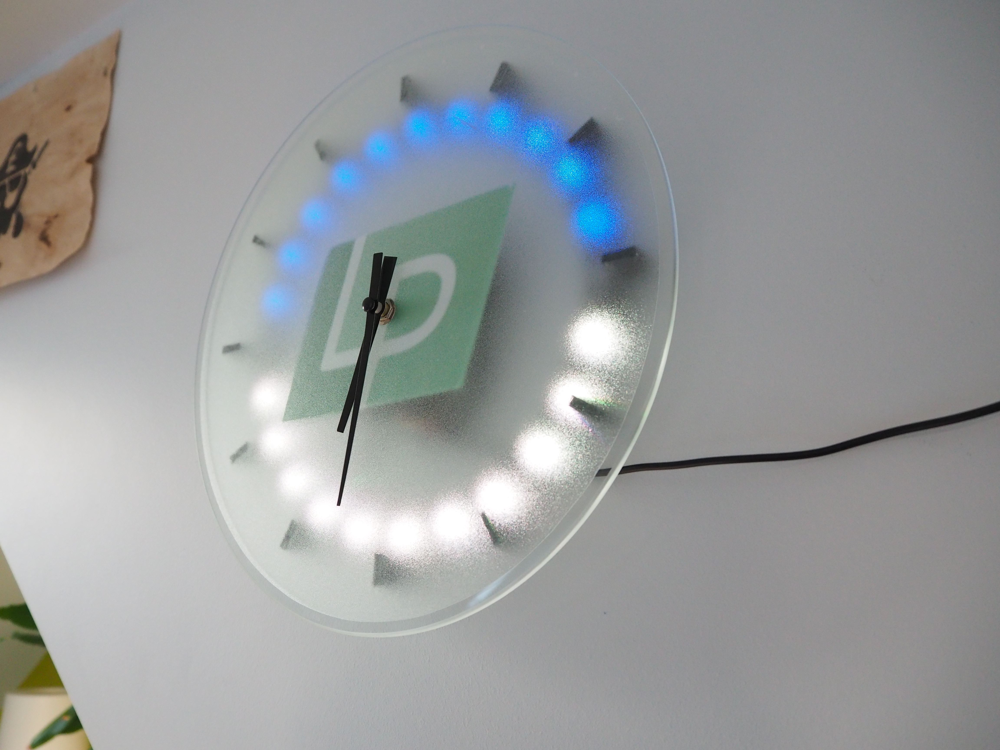
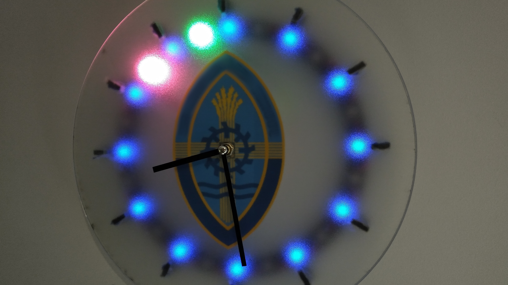

### OctoPrint Connected Wall Clock
# **OctoClock** 🕚 

Use a Raspberry Pi to create a custom, wall-mounted clock to keep tabs on your current 3D print jobs! 

☝️ My implementation of the OctoClock. (Shown in idle mode) The Raspberry Pi and related control electronics are hidden behind the logo to give the device a professional quality finnish.

☝️ My first attempt at an OctoClock. This one was created as a gift for my school (hence the inclusion of their logo) in order to monitor their new 3D printers. 

***
### Materials 📝
#### Clock:
- Glass base material (I salvaged mine from a children's wall clock by using hot water to remove the previous artwork from the back of the glass.)
- Glass frosting / privacy film to create the frosted effect on the face (you may even find real frosted glass)
- Analogue clock mechanism
- Sticky-back plastic to securely attach your chosen logo to the rear of the glass.
- 3D Printed parts

#### Electronics:
- Raspberry Pi (PiZero W is recommended) 🥧 
- WS128B Addressable LED Strip (You may also use an addressable LED ring to save effort) 💡
- Pre-Configured OctoPrint installation connected to your printer 🐙

#### Optional:
- Arduino, Attiny or similar micro-controller to provide bootup animation

***
### Build 🧱 
Please find a comprehensive build guide on Instructables or watch my YouTube video for more information. (TBC)

***
### Software 💽
#### Requirements:
The following python libraries must be downloaded in order for the software to function correctly. 
- Neopixels - `pip install rpi_ws281x adafruit-circuitpython-neopixel`
#### Configuration:
Find all the information required in the two files inside the 'config' folder. The two files are used as follows:  
`led_ring.conf` - Configure the settings for your clock face and its LEDs.  
`printers.conf` - Add as many connections as required to configure 3D Printers.
### **Note: Scripts using the neopixels library must be executed as root.**

#### Installing:
The python script is best utilized when configured as a linux service. The required files for setting up a service are included with this repository. The script 'install.sh' is provided to automatically install and configure the service.  
`sudo ./install.sh`

The service is installed as a root service as the neopixel library required root privileges.

#### Uninstalling:
The script called 'uninstall.sh' will reverse all of the actions performed by 'install.sh'.  
`sudo ./uninstall.sh`

***
### Repository 🗀 
Next steps / ideas:
- Web based administration interface
- Quite timer (LEDs switch off at certain times)
- Linux systemd service file
- Plugin system

Contribution:  
Any ideas you may have to improve the code would be amazing to hear; feel free to submit a GitHub issue or make your own changes and submit them to me as a pull request. This will become particularly relevant if I manage to implement a plugin system

***
##### Logo Credits:  
###### hourglass image - https://openclipart.org/detail/412/hourglass-with-sand
###### OctoPrint Logo - OctoPrint.org
